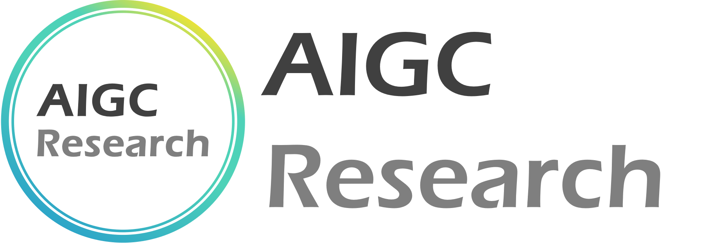

## Hi there 👋 Welcome to AIGC Research!!! 

We are the **AI4C Team (AI for Creativity)**, dedicated to advancing artistic content creation. Our work focuses on two key pathways: **"AI with Design Thinking"** and **"AI in Creative Workflows"**. Our ultimate vision is to democratize animation filmmaking and television production. 

If our work resonates with you, we warmly invite you to connect and collaborate with us. Together, let’s shape a novel creative world!

---

我们是**AI4C (AI for Creativity) 小分队**，致力于推动艺术内容创作。我们的工作主要集中在两个关键途径：**“具有设计思维的AI”**和**“创意工作流中的AI”**，终极愿景是使动画电影与电视制作民主化。

如果您对我们的工作感兴趣，我们热忱欢迎您与我们联系与合作。让我们共同塑造一个全新的创意世界！

*微信公众号**AIGC Research***

  
&nbsp;

  

    <b>Personal Website</b>
    
      <a href="https://journey-zhuang.github.io/">
        <i>Click me!</i>
      </a>
    

&nbsp;

  

<!--

**Here are some ideas to get you started:**

🙋‍♀️ A short introduction - what is your organization all about?
🌈 Contribution guidelines - how can the community get involved?
👩‍💻 Useful resources - where can the community find your docs? Is there anything else the community should know?
🍿 Fun facts - what does your team eat for breakfast?
🧙 Remember, you can do mighty things with the power of [Markdown](https://docs.github.com/github/writing-on-github/getting-started-with-writing-and-formatting-on-github/basic-writing-and-formatting-syntax)
-->
